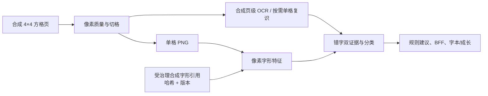

# E04 页级 OCR 与像素字形评分合成纵向切片验证

## 结论

- 日期：2026-08-12
- 状态：`verified-local-synthetic-glyph`
- 范围：批准的合成方格页、合成页级/单格 OCR、方格坐标对齐、受治理的标准字引用、四维像素评分、规则建议、BFF 聚合、字本及异步终态轮询。
- 结论：`synthetic-pipeline` 运行模式已不再使用预填四维分数的旧 OCR fixture。它实际解码合成练字页，切分单格，以页级坐标产生 OCR 证据、按需单格复识、读取哈希验证的合成标准字引用，并通过 `PixelGlyphFeatureProvider` 得到四维分数和问题代码。该过程仅证明工程链路可执行，不证明真实 OCR、标准字体、评分准确性或教育评价有效性。

## 执行链路

1. `generate-grid-fixtures.swift` 生成测试练字页，同时为目标字生成独立的 PNG 字形引用；只使用本机字体栅格化，不复制字体文件。
2. 元数据固定 `glyphReferenceVersion`、用途声明、单字文件名和 SHA-256；Provider 只接受该目录受控文件名，读取时复核哈希。
3. 合成 OCR 保留缺失单格、低置信冲突和目标“山”写成“出”的场景，使页级适配器实际执行按需复识与错字双证据规则。
4. `PixelGlyphFeatureProvider` 在同一任务内读取标准字，输出笔画规范、间架结构、字形比例、位置布局和可解释问题代码；裁剪图、字形图和底层特征不持久化。决策层仅把可观察问题代码转换为至多三项、不重复锚点的结构化朱红差异标注；完整问题仍保留在问题清单。
5. `AssessmentPipelineProvider` 把特征版本作为 `versions.score`、字形引用版本作为 `versions.glyph`；成长服务仍只在至少三次同版本可比记录后生成稳定性。

## 自动验证

- 16 字结果包含 `normal`、`wrong`、`needs_correction`、`uncertain`、`failed` 五类；其中错字、低置信和缺失单格分别保持相应证据边界。
- 所有有效评分结果的 `versions.score` 为 `pixel-glyph-features-v1+hanzi-pen-synthetic-reference-v1`，`versions.glyph` 为 `hanzi-pen-synthetic-reference-v1`。
- 页面、裁剪图和掩码特征不出现在最终评测结果；建议层可以在当次调用中读取有限数值特征。
- `wrong` 保留“目标字不一致”及已有确定性字形证据；`uncertain` 和 `failed` 不生成差异标注，避免把不确定结果渲染成确定的热力图或定位结论。
- BFF 纵向测试等待异步评测进入终态后，验证结果持久化、问题字聚合、成长样本、反馈重新评测、分享和删除闭环。
- 缺失或未登记字形引用、元数据用途不符、引用哈希不符均拒绝提供标准字，不生成代替分数。

## 不代表完成

- 合成页级 OCR 只按夹具确定的 4×4 坐标返回预设字符；它不是腾讯 OCR 的替身，也不证明真实图片中的切格、OCR、顺序对齐或置信度分布。
- 合成引用由现有测试夹具字体栅格化而来，仍明确不是可投产参考字形；投产候选现已采用思源宋体 2.003R/OFL-1.1，并完成可部署渲染、缓存和字形版本基础，见 [`licensed-glyph-cloud-hosting-foundation-2026-08-12.md`](./licensed-glyph-cloud-hosting-foundation-2026-08-12.md)。
- 特征阈值与 `correctionScoreThreshold` 仅为合成回归配置；真实学生数据、授权评测集、年龄/场景分层、专家一致性、准确率、成本和时延没有被本验证覆盖。
